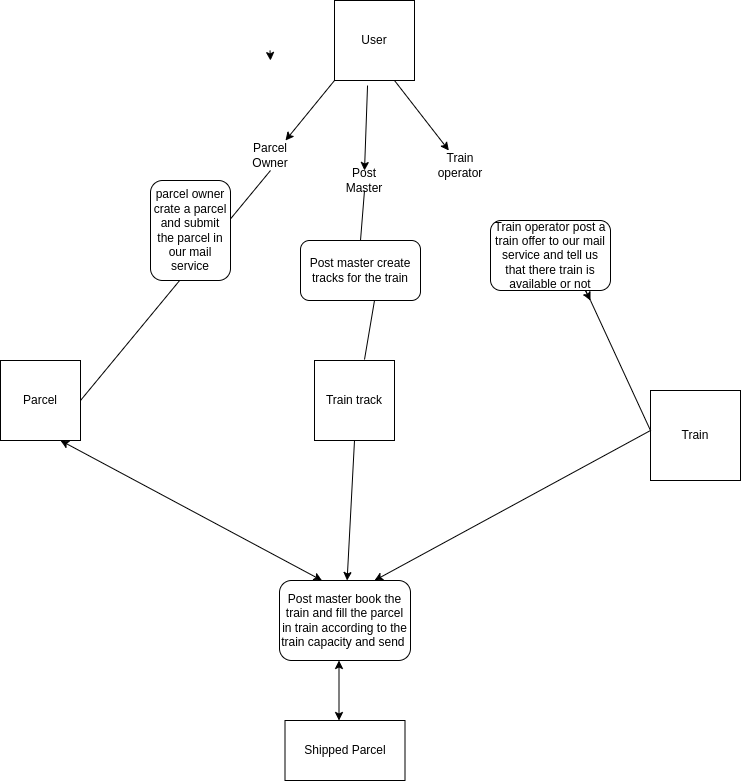

# The Mail Service
The mail service scheduling system backend I have created the api's for mail scheduling system by using the django rest framework and using postgres as a database and also containerized the project from docker.

## How to run the project
1. Download the zip file
2. Change your current directory <br>
```cd mail_service```
3. Create a .env file from the .env.example file <br>
``cp .env.example .env``
4. Run build and do the setup <br>
```make build```
5. Run your server <br>
```make runserver```
6. Open a new terminal Create the database <br>
```make init-db```
7. Migrate django models in your database <br>
```make migrate```
8. Stop your old container and again run your server <br>
```make runserver```


# Backend ApI
I have created the rest api's according to the given requirements and I have added a postman collection of all the required api's for the mail service scheduling system also I have added a description for every api in the postman collection.
* mail_service.postman_collection.json

# Model Architecture
